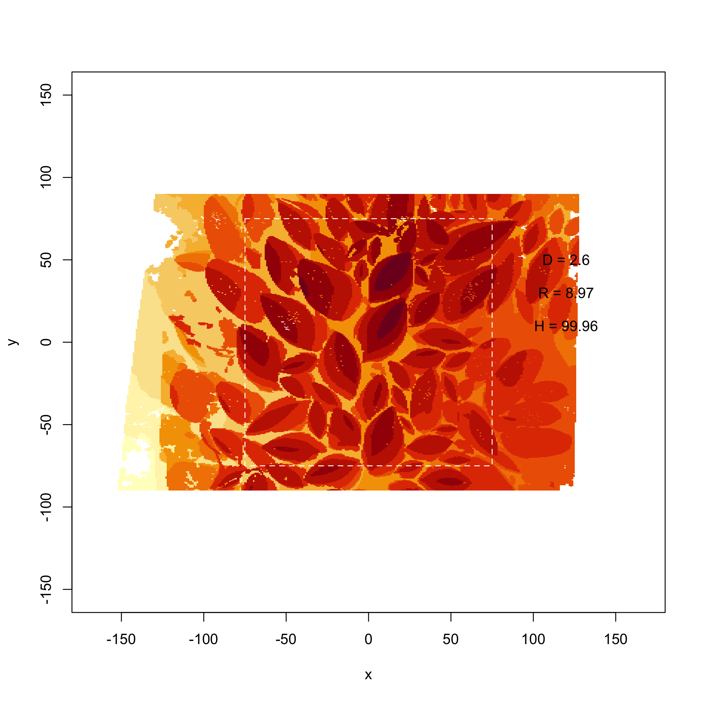
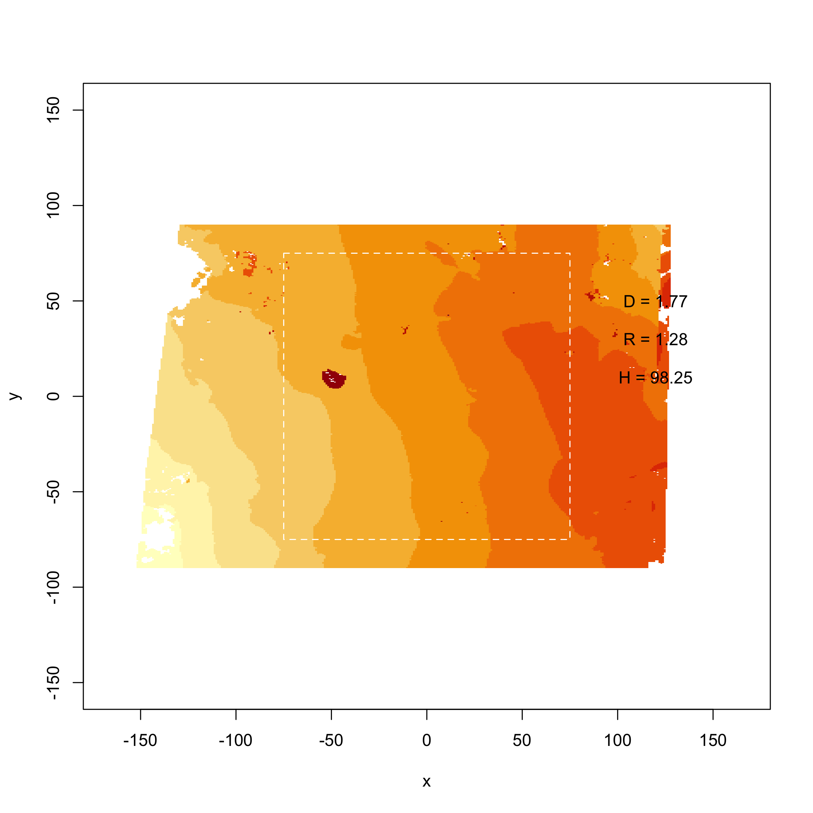

# Surface complexity for Oli

You need to pop the data file you sent me called "3D Points - WGR-P05 - Layer 1 and 3 Combined.txt" in the `data/oli` folder.

Then you should be able to just run the `analysis.R` code. There are essentially these steps:

1. Select the size of the patch for your calculations (`L`)
2. Select the scales across which fractal dimension will be calculated (`scl`), the smallest scale automatically is the resolution (`L0`)
3. Load a DEM file as `data` (geotif). Here we load your `xyz` file and create a raster. This is a hack, but just to give you a feel for the process.
4. Pick the bottom left point of the patch (`x0` and `y0`)
5. Run the `height_variation()` function, which is essentially a wrapper function (see `R/functions.R`). This function only requires the variables mentioned so far (`L`, `scl`, `L0`, `data`, `x0` and `y0`), so make sure there're assigned.  The output of the `height_variation()` function is the DEM height range the prescribed scales. For the largest scale `H` (or 2x2m) there is only one value for the entire patch, and the next scale down (1x1m) there are four values, and so on. Best to assign the output to a variable and save it somewhere (see the Example), because the smallest scales are very time-consuming.
6. Calculate the surface descriptor metrics using the `rdh()` function. This function only requires the output from `height_variation()`. `rdh()` sends back a list with several metrics:

Variable | Description
--- | ---
D | Fractal dimension from model fit
D_ends | Fractal dimension only considering the largest (L) and smallest (L0) scale
D_theory | Fractal dimension calculated from theory (i.e., from R and H)
R | Surface rugosity calculated using `surfaceArea` function in R
R_theory | Surface rugosity calculated from theory ()
H | The height range (or height range at L)

### Example results

